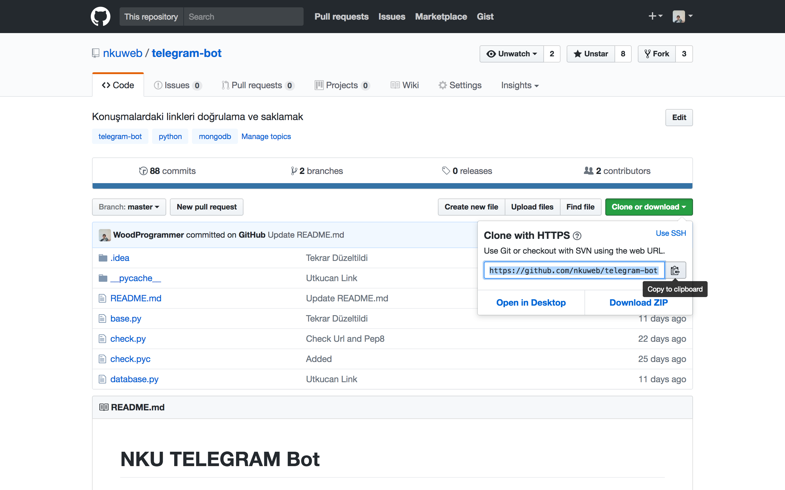
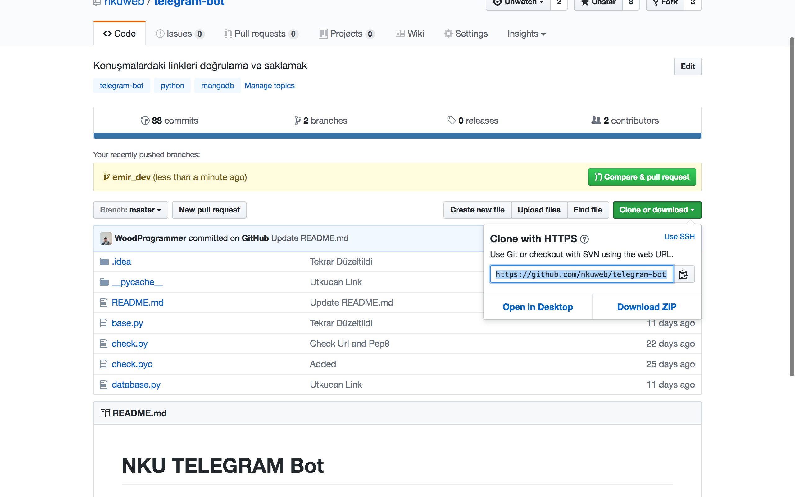
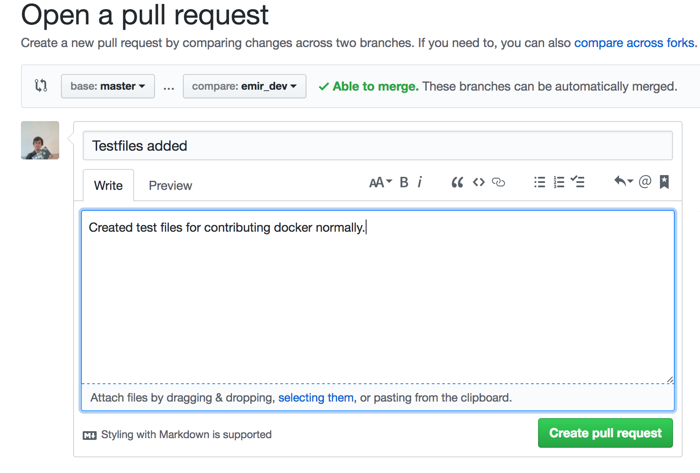
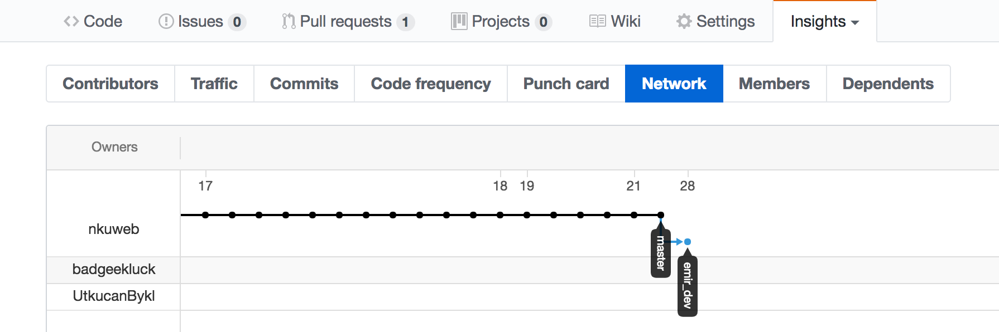

# EVERYTHINK

VERSION CONTROL AND CONTINOUS INTEGRATION TOOLS DOCS VOL - 1:

Herkese merhabalar başlığın Türkçe olması bazı şeylerin Türkçe çevirisinin aklımızdaki anlamı verememesidir.

İlk başlarda telegram botunda development yaparken Fork’lar üzerinden contribute yapınca conflictleri aşamıyoruz.

Bu da CI süreçlerimizde bazı tıkanıklıklar oluşturmakta.Bu nedenle hali hazırda kullandığımız Git sistemini daha verimli kullanmak için branchler üzerine ufak bir dökümantasyon yapayım istedim.
Branchler üzerinden gidince kendi değişikliklerimizi ana sistemden çekmeyi sağlıyor öbür türlü Forklayıp bir branch oluşturduğumuzda master branch zaten reponun sahibi biz oluyoruz hemde ana CI sürecinden kopmuş oluyoruz.

Şimdi sözü bırakıp işe koyulalım:




Reponun Github'daki yeri
Projeyi local ortamımıza clone'ladık.
```sh
  $ git clone [REPO_URL]
  $ cd [REPO_NAME]  
```
Sonrasında bazı basit değişiklikler yapalım
Test dosyaları ekleyelim mesela.
```sh
  $ touch test_1.py test_2.rb test_3.js
```
Sonrasında asıl maceraya başlayalım
```sh
  $ git add . ##Tüm directorydeki dosyaları ekledik.
  $ git commit -m  "Commit Mesajı"
```
Şimdi yeni branch oluşturalım
Pull Requestlerin görülmesi açısından ;
developer olan kişinin isminin geçmesi daha mantıklı.
```sh
  $ git checkout -u [DEVELOPER_NAME]_dev
  $ git remote add [DEVELOPER_NAME]_dev [REPO_URL]## artık bu branch bu repoya CI işlemleri yapabilir.
```
Artık branch adı ile push yapabilmekteyiz.

```sh
  $ git push -u [DEVELOPER_NAME]_dev
```
Sonrası Github'da yapacağımız güzel bir iki harekete bakıyor.
Şimdi onlara bakalım.


Buradaki görüntüye dikkat edelim beyler.Compare & Pull Request'e basalım ve PR oluşturalım.


Burada PR mesajları yazıp Commitleyelim.


Son olarak contributorstan network ' e basınca branchlerin durumunu görüyoruz.

Sorular için Telegram Grubuna yazınız iyi kod yazmalar.:)))
# Değişiklikleri Sisteme Entegre Etmek
Burada bazı hususlar mevcut.Mesela ben developer branchindeyim bu durumda değişiklikleri pull ederken
belli başlı trickler mevcut:
```sh
    $ git checkout master ##MASTER'daki değişikleri almak için master'a geçiyoruz
    $ git pull origin master dedikten sonra değişiklikleri alıyoruz.
    
```

# SON OLARAK
Commitler PR kapanana kadar genel olarak aynı Pull Request altında toplanır.

